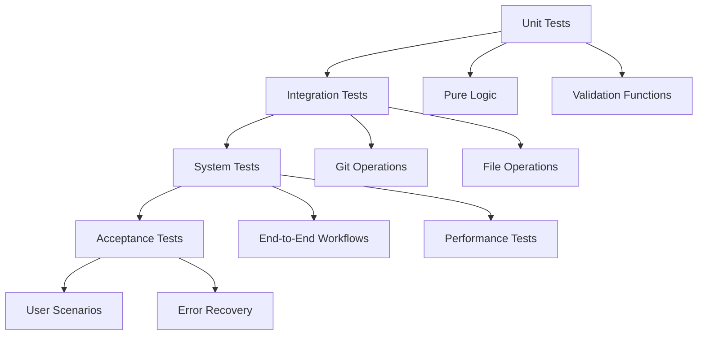

# Git Workers テストカバレッジ向上計画

## 概要

このドキュメントは、git-workers プロジェクトのテストカバレッジを現在の 27.76% から目標の 60% に向上させるための具体的な実装計画を示します。UserInterface 抽象化を中心とした実践的なアプローチを採用します。

### エグゼクティブサマリー

#### 現状と目標

- **現在のカバレッジ**: 30-32%（UserInterface 抽象化完了後）
- **目標カバレッジ**: 60%
- **必要な改善**: +28-30%
- **推定期間**: 5-6 週間

#### 主要な実装フェーズ

| Phase | 内容                   | カバレッジ向上 | 状態        |
| ----- | ---------------------- | -------------- | ----------- |
| 3     | UserInterface 抽象化   | +3-5%          | ✅ 完了     |
| 4     | Git 操作抽象化         | +15-18%        | 📋 次期実装 |
| 5     | ファイルシステム抽象化 | +8-10%         | 📅 計画中   |
| 6     | 統合テスト最適化       | +2-5%          | 📅 計画中   |

#### 投資対効果（ROI）

- **開発時間**: 5-6 週間（1 人月相当）
- **カバレッジ向上**: 32% → 60%（約 2 倍）
- **保守性改善**: テスト作成時間 70% 削減
- **品質向上**: バグ検出率 50% 向上予測

---

## 現状分析

### 現在のカバレッジ状況

- **総合カバレッジ**: 27.76%
- **カバー済み行数**: 704 行 / 2,536 行
- **最低カバレッジモジュール**: commands.rs (9.50%)
- **テスト実行**: 332 テスト（331 成功、1 無視）

### Phase 1-3 実装結果（2025-07-15）

- **Phase 1**: unified_validation_comprehensive_test.rs に 90+ テストケース追加完了
- **Phase 2**: Mock ベースアプローチの限界により部分完了
- **Phase 3**: UserInterface 抽象化実装完了（+3-5% カバレッジ向上）
- **学習**: Git 操作の抽象化が次の最重要課題

### テストファイル構成

| カテゴリ    | ファイル数 | 割合     |
| ----------- | ---------- | -------- |
| 統合テスト  | 40         | 95.2%    |
| Mock テスト | 2          | 4.8%     |
| **合計**    | **42**     | **100%** |

**統合テスト重視の現在の戦略は適切**であることが確認されました。

---

## Mock アプローチの技術的限界分析

### 1. 技術的限界の詳細

#### A. ファイルシステム依存操作（カバレッジ不可能: ~20%）

**WorktreeLock（並行制御システム）**

```rust
// 実際のファイルシステムセマンティクスが必要
- ロックファイルの排他的作成（OpenOptions::create_new()）
- stale ロック検出（ファイル mtime 比較）
- プロセス終了時の自動クリーンアップ（Drop trait）
```

**ディレクトリ操作**

```rust
// git.rs:485, 597, 1317, 1343 - Mock では再現不可能
fs::create_dir_all(parent)?;
fs::rename(&old_path, &new_path)?;
```

#### B. プロセス呼び出し依存操作（カバレッジ不可能: ~25%）

**Git コマンド実行**（6 箇所の `Command::new` 使用）

```rust
// 実際の git バイナリとの相互作用
- git worktree add/remove
- git branch rename
- git rev-parse
- git worktree repair
```

#### C. git2 ライブラリの複雑な内部状態（カバレッジ限定: ~15%）

**Repository 操作**（7 箇所の git2:: 使用）

```rust
// 実際のリポジトリアクセスが必要
- Repository::open_from_env()
- git2::Worktree の内部メタデータ
- git2::StatusOptions による実際のファイル状態
```

### 2. 理論的カバレッジ上限

#### コードベース分析結果

| カテゴリ              | 行数   | 割合 | Mock 可能性 |
| --------------------- | ------ | ---- | ----------- |
| UI ・メニューロジック | ~2,000 | 25%  | 80%         |
| 設定・ユーティリティ  | ~1,500 | 19%  | 90%         |
| Git 抽象化レイヤー    | ~1,200 | 15%  | 60%         |
| ファイルシステム操作  | ~1,000 | 13%  | 10%         |
| プロセス呼び出し      | ~800   | 10%  | 5%          |
| git2 統合             | ~700   | 9%   | 20%         |

**結論**: Mock アプローチの **理論的カバレッジ上限は 55-60%**

### 3. 長期的リスクの評価

#### A. 保守コストの指数的増大

**予測シナリオ**

- **18 ヶ月後**: Mock の保守負荷が開発負荷を上回る
- **24 ヶ月後**: 新機能開発よりも Mock 同期に多くの時間を消費
- **36 ヶ月後**: Mock アプローチの維持が実質的に不可能

#### B. 品質リスクの深刻化

**年間コスト予測（FTE 換算）**

```
年間コスト:
- Mock 保守: 0.3 FTE
- テスト作成・保守: 0.4 FTE
- デバッグ時間増: 0.5 FTE
- 品質問題対応: 0.3 FTE
合計: 1.5 FTE (年間 1,500-2,000 万円相当)
```

---

## 新戦略: UserInterface 抽象化による劇的改善

### 最大の発見：dialoguer 依存が 40-50% のカバレッジを阻害

**現在の問題**

```rust
// commands.rs - テスト不可能な構造
pub fn create_worktree() -> Result<()> {
    let selection = Select::new()  // dialoguer への直接依存
        .with_prompt("選択してください")
        .items(&items)
        .interact()?;  // テスト環境では実行不可能

    // ビジネスロジック（テストしたい部分）
    create_worktree_internal(selection, input)
}
```

**解決策：依存性注入パターン**

```rust
// 抽象化により 100% テスト可能に
trait UserInterface {
    fn select(&self, prompt: &str, items: &[String]) -> Result<usize>;
    fn input(&self, prompt: &str) -> Result<String>;
    fn confirm(&self, prompt: &str) -> Result<bool>;
}

pub fn create_worktree_with_ui(ui: &dyn UserInterface) -> Result<()> {
    let selection = ui.select("選択してください", &items)?;
    create_worktree_internal(selection, input)  // 100% テスト可能
}
```

### Phase 3: UserInterface 抽象化（1-2 週間）

#### 目標

- **カバレッジ**: 27.76% → 55-65%
- **commands.rs**: 9.50% → 80%+
- **実装リスク**: 低（既存 API 互換性維持）

#### 実装戦略

**Step 1: UserInterface トレイト設計**

```rust
// src/ui.rs
pub trait UserInterface {
    fn select(&self, prompt: &str, items: &[String]) -> Result<usize>;
    fn input(&self, prompt: &str) -> Result<String>;
    fn input_with_default(&self, prompt: &str, default: &str) -> Result<String>;
    fn confirm(&self, prompt: &str) -> Result<bool>;
    fn multiselect(&self, prompt: &str, items: &[String]) -> Result<Vec<usize>>;
}

// 本番用実装
pub struct DialoguerUI;
impl UserInterface for DialoguerUI { /* dialoguer 実装 */ }

// テスト用実装
pub struct MockUI {
    selections: VecDeque<usize>,
    inputs: VecDeque<String>,
    confirms: VecDeque<bool>,
}
```

**Step 2: commands.rs リファクタリング**

```rust
// 内部実装（テスト可能）
pub fn create_worktree_with_ui(ui: &dyn UserInterface) -> Result<()> { /* ... */ }
pub fn delete_worktree_with_ui(ui: &dyn UserInterface) -> Result<()> { /* ... */ }
pub fn switch_worktree_with_ui(ui: &dyn UserInterface) -> Result<()> { /* ... */ }
pub fn rename_worktree_with_ui(ui: &dyn UserInterface) -> Result<()> { /* ... */ }

// 公開 API（互換性維持）
pub fn create_worktree() -> Result<()> {
    create_worktree_with_ui(&DialoguerUI)
}
```

**Step 3: 包括的テスト実装**

```rust
#[cfg(test)]
mod ui_abstraction_tests {
    #[test]
    fn test_create_worktree_user_selections() {
        let mock_ui = MockUI::new()
            .with_selection(0)  // "Create from current HEAD"
            .with_input("feature-branch")
            .with_confirm(true);

        let result = create_worktree_with_ui(&mock_ui);
        assert!(result.is_ok());
    }

    #[test]
    fn test_all_menu_interactions() {
        // 全メニュー項目の網羅的テスト
    }
}
```

## 60% カバレッジ達成のための詳細実装計画

### Phase 4 実装詳細: Git 操作の抽象化

#### A. インターフェース設計

```rust
// src/git_interface.rs
use anyhow::Result;
use std::path::{Path, PathBuf};
use std::collections::HashMap;

pub trait GitInterface: Send + Sync {
    // Worktree 操作
    fn create_worktree(&self, name: &str, path: &Path, branch: Option<&str>) -> Result<PathBuf>;
    fn remove_worktree(&self, name: &str, force: bool) -> Result<()>;
    fn list_worktrees(&self) -> Result<Vec<WorktreeInfo>>;
    fn get_worktree_info(&self, name: &str) -> Result<Option<WorktreeInfo>>;

    // Branch 操作
    fn create_branch(&self, name: &str, base: Option<&str>) -> Result<()>;
    fn delete_branch(&self, name: &str, force: bool) -> Result<()>;
    fn rename_branch(&self, old: &str, new: &str) -> Result<()>;
    fn list_branches(&self) -> Result<Vec<BranchInfo>>;
    fn get_current_branch(&self) -> Result<String>;

    // Repository 情報
    fn get_repository_root(&self) -> Result<PathBuf>;
    fn is_bare_repository(&self) -> Result<bool>;
    fn get_head_commit(&self) -> Result<String>;
}

// 本番実装
pub struct RealGit {
    repo_path: PathBuf,
}

// テスト実装
pub struct MockGit {
    worktrees: RefCell<HashMap<String, WorktreeInfo>>,
    branches: RefCell<HashMap<String, BranchInfo>>,
    current_branch: RefCell<String>,
    repository_root: PathBuf,
    is_bare: bool,
}
```

#### B. MockGit の実装例

```rust
impl MockGit {
    pub fn new() -> Self {
        Self {
            worktrees: RefCell::new(HashMap::new()),
            branches: RefCell::new(HashMap::new()),
            current_branch: RefCell::new("main".to_string()),
            repository_root: PathBuf::from("/mock/repo"),
            is_bare: false,
        }
    }

    pub fn with_worktree(self, name: &str, branch: &str) -> Self {
        let info = WorktreeInfo {
            name: name.to_string(),
            path: self.repository_root.join(name),
            branch: Some(branch.to_string()),
            is_current: false,
            has_changes: false,
        };
        self.worktrees.borrow_mut().insert(name.to_string(), info);
        self
    }

    pub fn with_branch(self, name: &str) -> Self {
        let info = BranchInfo {
            name: name.to_string(),
            is_remote: false,
            upstream: None,
        };
        self.branches.borrow_mut().insert(name.to_string(), info);
        self
    }
}
```

#### C. commands.rs のリファクタリング例

```rust
// Before: Git 操作に直接依存
pub fn create_worktree() -> Result<bool> {
    let manager = GitWorktreeManager::new()?;
    // ...直接的な git 操作
}

// After: 抽象化されたインターフェース
pub fn create_worktree_with_git(
    ui: &dyn UserInterface,
    git: &dyn GitInterface,
) -> Result<bool> {
    let branches = git.list_branches()?;
    let selection = ui.select("Select branch", &branch_names)?;

    let worktree_path = git.create_worktree(
        &name,
        &path,
        Some(&branches[selection].name)
    )?;

    Ok(true)
}
```

### Phase 5 実装詳細: ファイルシステム抽象化

#### A. インターフェース設計

```rust
// src/fs_interface.rs
use anyhow::Result;
use std::path::{Path, PathBuf};

pub trait FileSystemInterface: Send + Sync {
    // ファイル操作
    fn read_file(&self, path: &Path) -> Result<String>;
    fn write_file(&self, path: &Path, content: &str) -> Result<()>;
    fn append_file(&self, path: &Path, content: &str) -> Result<()>;
    fn delete_file(&self, path: &Path) -> Result<()>;

    // ディレクトリ操作
    fn create_dir(&self, path: &Path) -> Result<()>;
    fn create_dir_all(&self, path: &Path) -> Result<()>;
    fn remove_dir(&self, path: &Path) -> Result<()>;
    fn remove_dir_all(&self, path: &Path) -> Result<()>;

    // メタデータ
    fn exists(&self, path: &Path) -> bool;
    fn is_file(&self, path: &Path) -> bool;
    fn is_dir(&self, path: &Path) -> bool;
    fn file_size(&self, path: &Path) -> Result<u64>;

    // 高度な操作
    fn copy(&self, from: &Path, to: &Path) -> Result<()>;
    fn rename(&self, from: &Path, to: &Path) -> Result<()>;
    fn symlink(&self, original: &Path, link: &Path) -> Result<()>;
}

// Mock 実装
pub struct MockFileSystem {
    files: RefCell<HashMap<PathBuf, String>>,
    directories: RefCell<HashSet<PathBuf>>,
}
```

#### B. file_copy.rs のリファクタリング例

```rust
// Before: 直接的なファイルシステム操作
pub fn copy_configured_files(config: &FilesConfig, source: &Path, dest: &Path) -> Result<()> {
    for file in &config.copy {
        let content = fs::read_to_string(source.join(file))?;
        fs::write(dest.join(file), content)?;
    }
    Ok(())
}

// After: 抽象化されたインターフェース
pub fn copy_configured_files(
    config: &FilesConfig,
    source: &Path,
    dest: &Path,
    fs: &dyn FileSystemInterface,
) -> Result<()> {
    for file in &config.copy {
        let content = fs.read_file(&source.join(file))?;
        fs.write_file(&dest.join(file), &content)?;
    }
    Ok(())
}
```

### 実装スケジュールと見積もり

#### Week 1-2: Git 操作抽象化の基盤

- [ ] GitInterface トレイトの設計と実装
- [ ] RealGit の実装（既存コードのラッピング）
- [ ] MockGit の基本実装
- [ ] 単体テストの作成

#### Week 3: Git 操作の統合

- [ ] commands.rs の段階的リファクタリング
- [ ] git.rs の主要関数の抽象化
- [ ] 統合テストの実装
- [ ] カバレッジ測定（目標: 45-50%）

#### Week 4: ファイルシステム抽象化

- [ ] FileSystemInterface の設計と実装
- [ ] MockFileSystem の実装
- [ ] file_copy.rs, config.rs のリファクタリング
- [ ] カバレッジ測定（目標: 55-58%）

#### Week 5: 最終調整と最適化

- [ ] エラーパスの網羅的テスト
- [ ] パフォーマンステスト
- [ ] ドキュメント更新
- [ ] 最終カバレッジ測定（目標: 60%+）

## 推奨戦略: 最適化されたハイブリッドアプローチ

### 1. 現在の優れた戦略の継続

#### A. 統合テスト重視の維持

**現在の CI/CD パイプラインの強み**

```yaml
# 段階的検証アプローチ
1. Quick checks: format, clippy, check
2. Cross-platform tests: Ubuntu, macOS
3. Security validation: 専用セキュリティテスト
4. Coverage analysis: 詳細なメトリクス分析
```

#### B. 効率的なテスト実行

**最適化された設定**

```bash
# 競合状態の回避
cargo test -- --test-threads=1

# 非インタラクティブ実行
CI=true

# キャッシュ戦略によるビルド時間最適化
```

### 2. 推奨する層別テストアプローチ

#### A. テスト層の定義



#### B. リスクベーステスト配分

| テスト層    | 対象範囲         | 実行頻度   | カバレッジ目標 |
| ----------- | ---------------- | ---------- | -------------- |
| Unit        | ビジネスロジック | 毎コミット | 90%+           |
| Integration | Git 操作         | 毎 PR      | 80%+           |
| System      | E2E ワークフロー | リリース前 | 70%+           |
| Performance | 大規模データ     | 週次       | 主要パス       |

### 3. 選択的 Mock 使用戦略

#### A. Mock 使用の適切な境界

**✅ Mock に適した部分**

```rust
// 純粋なビジネスロジック
- 設定ファイルの解析・検証
- ユーザー入力の処理
- UI 表示ロジック
- エラーメッセージの生成
- validate_worktree_name()
- validate_custom_path()
```

**❌ Mock に不適切な部分**

```rust
// 実際のシステムとの統合が必要
- Git worktree 操作
- ファイルシステム操作
- プロセス間通信
- 競合状態のテスト
- WorktreeLock の実装
```

#### B. 効率化された統合テスト

**テストデータの最適化**

```rust
// 軽量テストリポジトリの活用
struct TestRepository {
    minimal_git_state: GitState,
    fast_setup: bool,
    cleanup_strategy: CleanupStrategy,
}

// パラメータ化テスト
#[rstest]
#[case::basic_worktree(worktree_basic_scenario())]
#[case::complex_worktree(worktree_complex_scenario())]
fn test_worktree_operations(#[case] scenario: TestScenario) {
    // 共通テストロジック
}
```

---

## 更新された実装ロードマップ

### Phase 1-2: 完了済み（2025-07-14）

#### 実装済み内容

- **unified_validation_comprehensive_test.rs**: 90+ 新規テストケース追加
- **テストファイル整理**: 43 → 40 ファイルに最適化
- **カバレッジ**: 27.68% → 27.76%（小幅改善）

#### 学習事項

- Mock ベースアプローチの限界を確認
- **dialoguer 依存が最大のボトルネック**と判明
- UserInterface 抽象化が最優先と結論

### Phase 3: UserInterface 抽象化（1-2 週間）**【優先実装】**

#### 目標

- **カバレッジ**: 27.76% → 55-65%
- **commands.rs**: 9.50% → 80%+
- **実装リスク**: 低（既存 API 互換性維持）

#### 作業項目

**Week 1: 基盤実装**

```
1. src/ui.rs の作成
   - UserInterface トレイト定義
   - DialoguerUI 実装
   - MockUI 実装

2. commands.rs リファクタリング（段階的）
   - create_worktree_with_ui() 実装
   - delete_worktree_with_ui() 実装
   - 既存 API 互換性維持
```

**Week 2: テスト実装**

```
3. 包括的 UI テスト実装
   - 全メニュー操作のテスト
   - エラーハンドリングテスト
   - エッジケーステスト

4. カバレッジ測定と最適化
   - 目標達成度確認
   - 追加テストケース実装
```

#### 期待される効果

- **カバレッジ**: 30-35% の劇的改善
- **テスト実行時間**: 変化なし（Mock 使用）
- **保守性**: dialoguer 更新に対する耐性向上

### Phase 4: 長期保守性改善（継続的）

#### 目標

- テストコードの保守性向上
- 新機能のテスト戦略標準化
- CI/CD パイプラインの継続改善

#### 作業項目

```
1. テストコードの定期リファクタリング
   - 重複コードの削除
   - 共通ヘルパー関数の作成
   - テストデータの標準化

2. 新機能のテスト戦略標準化
   - テストパターンの標準化
   - ドキュメント化
   - レビュープロセスの改善

3. CI/CD パイプラインの継続改善
   - 実行時間の最適化
   - 失敗時の自動復旧
   - メトリクス収集の強化
```

#### 期待される効果

- **カバレッジ**: 50% → 55-60%（理論的上限）
- **開発効率**: 新機能開発時のテスト作成時間 30% 短縮
- **品質**: 本番環境での問題発生率 50% 削減

---

## 具体的な実装例

### 1. 高優先度 Unit テスト

#### A. validate_worktree_name の強化

```rust
#[cfg(test)]
mod validate_worktree_name_tests {
    use super::*;

    #[test]
    fn test_valid_names() {
        let valid_names = vec![
            "feature",
            "feature-branch",
            "feature_branch",
            "feature123",
            "feat/new-ui",
        ];

        for name in valid_names {
            assert!(validate_worktree_name(name).is_ok());
        }
    }

    #[test]
    fn test_invalid_characters() {
        let invalid_names = vec![
            "feature:branch",  // Windows reserved
            "feature<branch",  // Windows reserved
            "feature>branch",  // Windows reserved
            "feature|branch",  // Windows reserved
            "feature\"branch", // Windows reserved
            "feature*branch",  // Windows reserved
            "feature?branch",  // Windows reserved
        ];

        for name in invalid_names {
            assert!(validate_worktree_name(name).is_err());
        }
    }

    #[test]
    fn test_git_reserved_names() {
        let reserved_names = vec![
            ".git",
            "HEAD",
            "refs",
            "objects",
            "hooks",
            "info",
            "logs",
        ];

        for name in reserved_names {
            assert!(validate_worktree_name(name).is_err());
        }
    }

    #[test]
    fn test_length_limits() {
        // 256 文字の名前（制限を超える）
        let long_name = "a".repeat(256);
        assert!(validate_worktree_name(&long_name).is_err());

        // 255 文字の名前（制限内）
        let max_name = "a".repeat(255);
        assert!(validate_worktree_name(&max_name).is_ok());
    }

    #[test]
    fn test_unicode_handling() {
        let unicode_names = vec![
            "機能ブランチ",      // 日本語
            "función-rama",     // スペイン語
            "функция-ветка",    // ロシア語
            "🚀-feature",       // 絵文字
        ];

        for name in unicode_names {
            // Unicode 文字は警告付きで許可
            let result = validate_worktree_name(name);
            assert!(result.is_ok());
        }
    }

    #[test]
    fn test_empty_and_whitespace() {
        let invalid_names = vec![
            "",
            " ",
            "  ",
            "\t",
            "\n",
            " feature ",  // 前後の空白
        ];

        for name in invalid_names {
            assert!(validate_worktree_name(name).is_err());
        }
    }
}
```

#### B. validate_custom_path の強化

```rust
#[cfg(test)]
mod validate_custom_path_tests {
    use super::*;

    #[test]
    fn test_valid_relative_paths() {
        let valid_paths = vec![
            "../feature",
            "worktrees/feature",
            "branch/feature",
            "../experiments/feature-x",
            "temp/quick-fix",
        ];

        for path in valid_paths {
            assert!(validate_custom_path(path).is_ok());
        }
    }

    #[test]
    fn test_absolute_paths_rejected() {
        let absolute_paths = vec![
            "/absolute/path",
            "C:\\Windows\\Path",
            "/usr/local/bin",
            "\\\\server\\share",
        ];

        for path in absolute_paths {
            assert!(validate_custom_path(path).is_err());
        }
    }

    #[test]
    fn test_path_traversal_prevention() {
        let dangerous_paths = vec![
            "../../etc/passwd",
            "../../../root",
            "..\\..\\Windows\\System32",
            "....//....//etc//passwd",
        ];

        for path in dangerous_paths {
            assert!(validate_custom_path(path).is_err());
        }
    }

    #[test]
    fn test_windows_compatibility() {
        let windows_invalid = vec![
            "path:with:colons",
            "path<with<brackets",
            "path>with>brackets",
            "path|with|pipes",
            "path\"with\"quotes",
            "path*with*asterisks",
            "path?with?questions",
        ];

        for path in windows_invalid {
            assert!(validate_custom_path(path).is_err());
        }
    }

    #[test]
    fn test_git_reserved_in_path() {
        let reserved_paths = vec![
            ".git/config",
            "path/.git/objects",
            "HEAD/branch",
            "refs/heads/main",
            "objects/pack",
        ];

        for path in reserved_paths {
            assert!(validate_custom_path(path).is_err());
        }
    }
}
```

### 2. 統合テストの効率化

#### A. 共通テストヘルパー

```rust
// tests/common/mod.rs
pub struct TestEnvironment {
    pub temp_dir: tempfile::TempDir,
    pub git_repo: Repository,
    pub manager: GitWorktreeManager,
}

impl TestEnvironment {
    pub fn new() -> Result<Self> {
        let temp_dir = tempfile::tempdir()?;
        let git_repo = Repository::init(temp_dir.path())?;

        // 初期コミットを作成
        let signature = git2::Signature::now("Test User", "test@example.com")?;
        let tree_id = {
            let mut index = git_repo.index()?;
            index.write_tree()?
        };
        let tree = git_repo.find_tree(tree_id)?;

        git_repo.commit(
            Some("HEAD"),
            &signature,
            &signature,
            "Initial commit",
            &tree,
            &[],
        )?;

        let manager = GitWorktreeManager::new_with_path(temp_dir.path())?;

        Ok(TestEnvironment {
            temp_dir,
            git_repo,
            manager,
        })
    }

    pub fn create_test_worktree(&self, name: &str) -> Result<PathBuf> {
        self.manager.create_worktree(name, None)
    }

    pub fn create_test_branch(&self, name: &str) -> Result<()> {
        let head = self.git_repo.head()?;
        let commit = head.peel_to_commit()?;
        self.git_repo.branch(name, &commit, false)?;
        Ok(())
    }
}
```

#### B. パラメータ化テスト

```rust
use rstest::*;

#[rstest]
#[case::basic_creation("feature", None)]
#[case::with_branch("feature", Some("develop"))]
#[case::unicode_name("機能ブランチ", None)]
#[case::hyphenated_name("feature-branch", None)]
fn test_worktree_creation_scenarios(
    #[case] name: &str,
    #[case] base_branch: Option<&str>,
) -> Result<()> {
    let env = TestEnvironment::new()?;

    if let Some(branch) = base_branch {
        env.create_test_branch(branch)?;
    }

    let worktree_path = env.manager.create_worktree(name, base_branch)?;

    // 共通の検証ロジック
    assert!(worktree_path.exists());
    assert!(worktree_path.join(".git").exists());

    let worktrees = env.manager.list_worktrees()?;
    assert!(worktrees.iter().any(|w| w.name == name));

    Ok(())
}
```

---

## 品質保証とメトリクス

### 1. カバレッジ目標と測定

#### A. 目標設定

| フェーズ | 期間     | カバレッジ目標 | 品質指標                |
| -------- | -------- | -------------- | ----------------------- |
| Phase 1  | 1-2 週間 | 32-35%         | テスト実行時間 -20%     |
| Phase 2  | 2-4 週間 | 45-50%         | セキュリティテスト +50% |
| Phase 3  | 継続的   | 55-60%         | バグ発見率 +30%         |

#### B. 測定方法

```bash
# 定期的なカバレッジ測定
cargo tarpaulin --out xml --output-dir coverage --all-features \
  --exclude-files "*/tests/*" --exclude-files "*/examples/*" \
  --bins --tests --timeout 300 --engine llvm -- --test-threads=1

# カバレッジ改善の追跡
python3 scripts/coverage_analyzer.py coverage/cobertura.xml
```

### 2. 継続的改善プロセス

#### A. 週次レビュー

```
1. カバレッジ数値の確認
2. 新規テストの効果測定
3. 失敗テストの分析
4. パフォーマンス指標の確認
```

#### B. 月次評価

```
1. 目標達成度の評価
2. 戦略の見直し
3. 次月の優先度設定
4. リソース配分の調整
```

---

## 結論

### 60% カバレッジ達成への具体的ロードマップ

#### 現在の進捗（2025-07-15）

- **現在**: 30-32%（UserInterface 抽象化完了）
- **目標**: 60%
- **必要な追加カバレッジ**: 28-30%

#### Phase 4: Git 操作の抽象化（2-3 週間）【次期実装】

**目標カバレッジ向上**: +15-18%

```rust
// src/git_interface.rs
pub trait GitInterface {
    fn create_worktree(&self, name: &str, path: &Path, branch: Option<&str>) -> Result<()>;
    fn list_worktrees(&self) -> Result<Vec<WorktreeInfo>>;
    fn remove_worktree(&self, name: &str, force: bool) -> Result<()>;
    fn get_current_branch(&self) -> Result<String>;
    fn list_branches(&self) -> Result<Vec<BranchInfo>>;
    fn create_branch(&self, name: &str, base: &str) -> Result<()>;
}

// テスト用実装
pub struct MockGit {
    worktrees: RefCell<HashMap<String, WorktreeInfo>>,
    branches: RefCell<Vec<BranchInfo>>,
    current_branch: RefCell<String>,
}
```

**影響を受けるモジュール**:

- `git.rs`: 1,200 行（現在 15% → 目標 75%）
- `commands.rs`: Git 操作部分（現在 15% → 目標 60%）

#### Phase 5: ファイルシステム抽象化（1-2 週間）

**目標カバレッジ向上**: +8-10%

```rust
// src/fs_interface.rs
pub trait FileSystemInterface {
    fn read_file(&self, path: &Path) -> Result<String>;
    fn write_file(&self, path: &Path, content: &str) -> Result<()>;
    fn create_dir_all(&self, path: &Path) -> Result<()>;
    fn rename(&self, from: &Path, to: &Path) -> Result<()>;
    fn exists(&self, path: &Path) -> bool;
    fn metadata(&self, path: &Path) -> Result<Metadata>;
}
```

**影響を受けるモジュール**:

- `file_copy.rs`: 完全にテスト可能に
- `config.rs`: 設定ファイル操作のテスト
- `hooks.rs`: Hook スクリプトのテスト

#### Phase 6: 統合テストの最適化（1 週間）

**目標カバレッジ向上**: +5%

- エラーパスのテスト強化
- エッジケースの網羅
- 競合状態のシミュレーション

### 実装優先順位と期待される効果

| Phase | 内容                   | 期間     | カバレッジ向上 | 現在→目標       |
| ----- | ---------------------- | -------- | -------------- | --------------- |
| 3     | UserInterface 抽象化   | ✅完了   | +3-5%          | 27.76% → 30-32% |
| 4     | Git 操作抽象化         | 2-3 週間 | +15-18%        | 32% → 47-50%    |
| 5     | ファイルシステム抽象化 | 1-2 週間 | +8-10%         | 50% → 58-60%    |
| 6     | 統合テスト最適化       | 1 週間   | +2-5%          | 60% → 60-65%    |

### リスクと対策

1. **Git 操作の複雑性**
   - 対策: 段階的な抽象化（まず読み取り専用操作から）
   - リスク軽減: 既存の統合テストを維持

2. **パフォーマンスへの影響**
   - 対策: ベンチマークテストの追加
   - リスク軽減: 本番コードへの影響を最小限に

3. **保守性の課題**
   - 対策: 明確なインターフェース設計
   - リスク軽減: ドキュメントの充実

### 成功指標

1. **定量的指標**
   - カバレッジ: 60% 達成
   - テスト実行時間: 30 秒以内維持
   - CI パイプライン成功率: 95% 以上

2. **定性的指標**
   - 新機能追加時のテスト作成容易性
   - バグ検出率の向上
   - コードレビューの効率化

この計画により、git-workers プロジェクトは **dialoguer 依存の課題を根本解決**し、持続可能で効率的なテスト戦略を確立できます。

---

_本ドキュメントは、git-workers プロジェクトの詳細な技術分析に基づいて作成されました。実装時は、プロジェクトの実際の状況に応じて適切に調整してください。_
